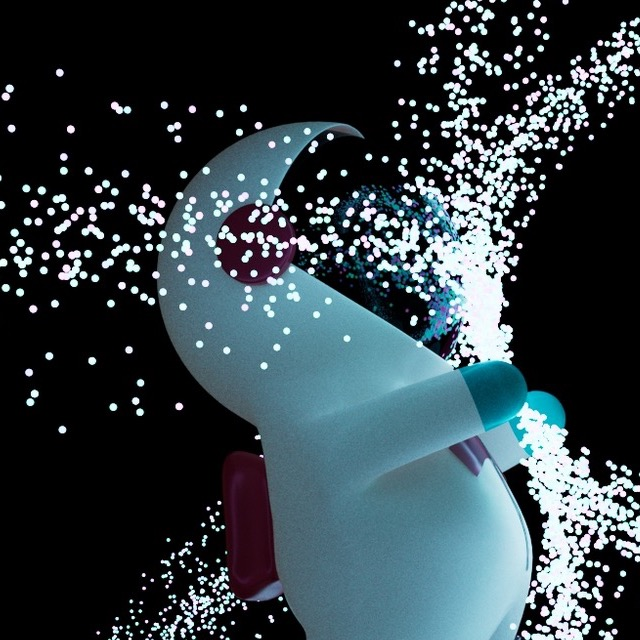
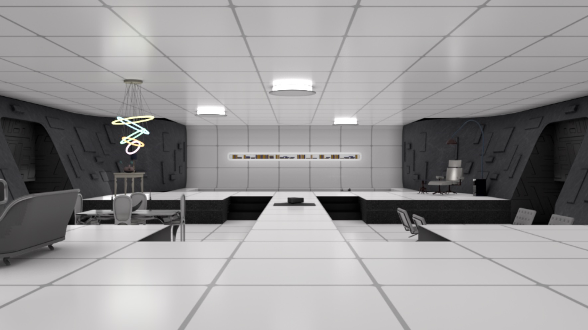



# Dartmouth digital arts
_Maya_

I took 3D modelling (CS22) and 3D Animation (CS24) at Dartmouth. Here are a few things I made.

## Custom biped 

I modelled and rigged a spaceman, and animated the following short video with it:

  <iframe width="560" height="315" src="https://www.youtube.com/embed/TfeUhWUZmMM" title="YouTube video player" frameborder="0" allow="accelerometer; autoplay; clipboard-write; encrypted-media; gyroscope; picture-in-picture; web-share" allowfullscreen></iframe>

## Abstract

There were no hard rules to follow for this one, so I built off the biped I was making.

  

 

I was trying to express how I feel when I'm doing math— there's so much beautiful complexity and you're just
trying your best to contain it in a way you can understand and use.

## Room

One of my favorite movies, and one that heavily influenced the aesthethic I'm drawn to, is _Tron: Legacy_.
For this assignment I tried to recreate a room from it.

  

 

This was my first assignment in the class, and there are a number of things I wish I would have done better.
I had initially intended to include a lightcycle, but it turned out to be beyond my skillset at the time. I 
also think I could have played more with the shadows and color, to make parts of the scene pop out more.

## Animation Short Movie

For our final project in animation class we could pick a model and create a very short movie with it, something
that communicated a change in emotion.

  <iframe width="560" height="315" src="https://www.youtube.com/embed/wuvUe5Nw_Z8" title="YouTube video player" frameborder="0" allow="accelerometer; autoplay; clipboard-write; encrypted-media; gyroscope; picture-in-picture; web-share" allowfullscreen></iframe>

 

One of my biggest influences in animation has to be Tom and Jerry, and I tried to draw on the way Tom would 
sneak around and jump off screen.

# Poetry

- [the ice queen](http://varunmalladi.github.io/creative-work/ice-queen)
