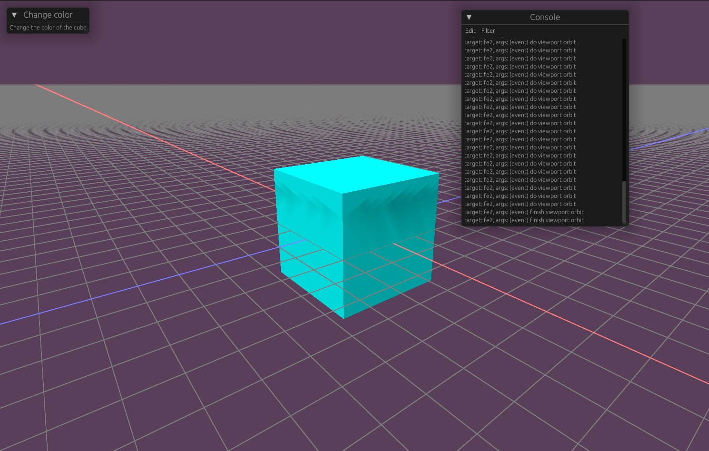



# Bilateral Grids via Compute Shaders
_Swift + Metal Shading Langauge_

I implemented the bilateral grid data structure utilizing compute shaders, which were not available at the time of their conception. 

    <iframe width="560" height="315" src="https://www.youtube.com/embed/QYdRgKXxz-w" title="YouTube video player" frameborder="0" allow="accelerometer; autoplay; clipboard-write; encrypted-media; gyroscope; picture-in-picture; web-share" allowfullscreen></iframe>

I applied the bilateral grid to a couple applications, such as bilateral filtering.

[GitHub](https://github.com/treemcgee42/bilateral-grid)

[Paper](/files/cs73_final.pdf)

# DARTS Ray Tracing Engine
_C++_

My extension to the Dartmouth Academic Ray Tracing Skeleton. This project implements features such as parametric surfaces and meshes, 
Monte Carlo integration, and multiple importance sampling. For the final rendering competition my partner and I received special 
mention for the following render:

  

 

There are two major features on display here. First, the skin is rendered using volumetric scattering techniques. Second, the glowing 
facial material is fluorescent; the primary light source in the scene is actually the dark hand. It is emitting light outside the 
visible spectrum, which the fluorescent materials picks up and re-emits within the visible spectrum.

(closed source: college policy)

# ekki Graphics Frontend
_Rust + wgpu_

I realized while working on my ray tracer that a lot of boilerplate and debugging was spent on parsing scenes and displaying results. 
Even when this worked it was difficult to edit the scene files, considering they were all json. My goal with this project is to 
provide a common frontend that programs like ray tracers can use to visualize their input and output, and through which they can be
easily invoked.

  

 

The project is still in its early stages. I'm currently working on the infrastructure to load C dynamic libraries at runtime, which is
how I imagine a computationally expensive program would be invoked through the frontend.

[GitHub](https://github.com/treemcgee42/ekki)

# Mini C compiler
_C++ + Flex/Bison + LLVM_

Parsing, optimizing, and generating assembly for a small subset of the C language. The frontend used Flex and Bison, and supported 
multiple errors (didn't crash on the first encountered error). The AST was then lowered directly to LLVM IR, and at this stage
I reimplemented a few optimization passes on the IR. The last component was generating assembly for our x32 target machine from 
the IR. Basically LLVM was used for it's IR and methods for modifying that IR.

I'm hoping to work on another compiler soon, for a subset of Rust. 

(closed source: college policy)

# Yalnix OS Kernel
_C_

This was a kernel targetting the "Yalnix" simulation, which simulates basic hardware on top of a Linux OS. In this project, my 
partner and I wrote a kernel which initialized virtual memory, managed multiple processes, handled a multitude of traps and 
syscalls, facilitated interprocess communication by implementing pipes, and supported user simultaneous IO across processes.

(closed source: college policy)
